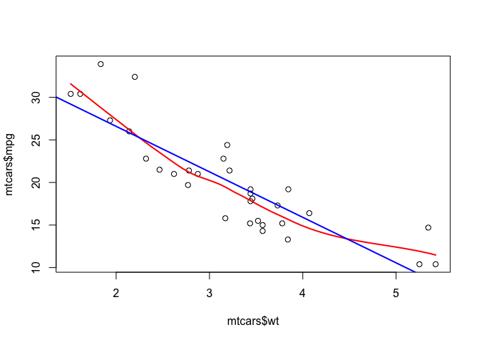
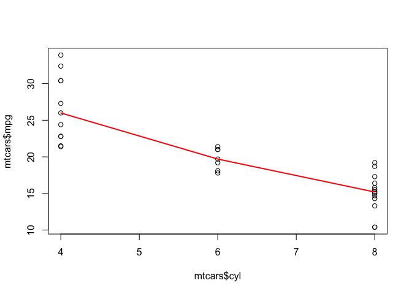
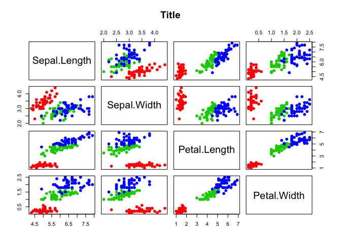
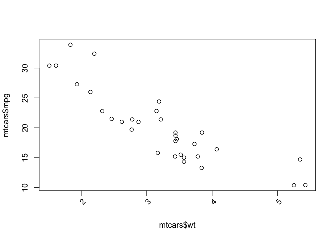
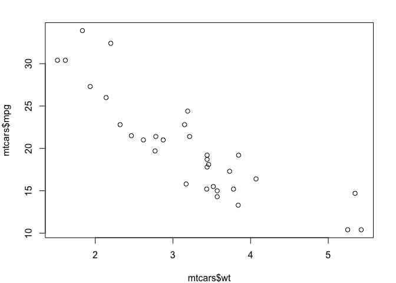
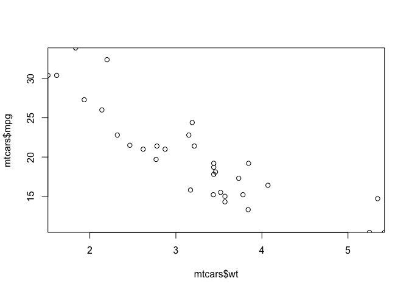

Colors
======

Make transparent colors
-----------------------

### Using `rgb()`

``` r
color  <- col2rgb('dodgerblue3')
alpha  <- 0.5
plot(..., col = rgb(color[1], color[2], color[3], alpha = 255 * alpha, max = 255))
```

### Using HEX

The HEX color should be in the format `#RRGGBBAA`, where R is for red, G is for green, B is for blue and A is for alpha in hexadecimals.

``` r
# Hex color example of dodgerblue3 with alpha of 0.5.
color <- '#1874cd80'
plot(..., col = color)
```

``` r
# Conversion between HEX and decimal in R
as.integer(paste0('0X', 'ff'))   # hex to decimal
```

    ## [1] 255

``` r
as.hexmode(255)                  # decimal to hex
```

    ## [1] "ff"

*See also r hex convertor [`hex_color()`](https://github.com/guiastrennec/modelviz/blob/master/R/hex_color.R) a hex color converter using `x11_hex()` from the package [diagrammeR](https://github.com/rich-iannone/DiagrammeR).*

Palettes
--------

A couple nice colors for graphs. See also [Colorbrewer](http://colorbrewer2.org) for many more examples.

### Color example

``` r
palette  <- c(rgb(166, 206, 227, maxColorValue = 255),
              rgb(31 , 120, 180, maxColorValue = 255), # Blues
              rgb(178, 223, 138, maxColorValue = 255),
              rgb(51 , 160,  44, maxColorValue = 255), # Greens
              rgb(251, 154, 153, maxColorValue = 255),
              rgb(227,  26,  28, maxColorValue = 255), # Reds
              rgb(253, 191, 111, maxColorValue = 255),
              rgb(255, 127,   0, maxColorValue = 255), # Oranges
              rgb(202, 178, 214, maxColorValue = 255),
              rgb(106,  61, 154, maxColorValue = 255)) # Purples

blues   <- c('dodgerblue2', 'deepskyblue2', 'cornflowerblue',
             'dodgerblue3', 'dodgerblue4', 'darkblue')

reds    <- c('tomato2', 'indianred2', 'coral')

purples <- c('slateblue2', 'violetred2')

greens  <- c('yellowgreen', 'chartreuse3')
```

### Create range of colors

``` r
my_palette <- colorRampPalette(c('white', 'blue'))
my_palette(10)
```

    ##  [1] "#FFFFFF" "#E2E2FF" "#C6C6FF" "#AAAAFF" "#8D8DFF" "#7171FF" "#5555FF"
    ##  [8] "#3838FF" "#1C1CFF" "#0000FF"

### Mimic [`ggplot2`](http://ggplot2.org) colors

Function from John Colby on [stack overflow](http://stackoverflow.com/questions/8197559/emulate-ggplot2-default-color-palette)

``` r
gg_color_hue <- function(n) {
  hues = seq(15, 375, length = n + 1)
  hcl(h = hues, l = 65, c = 100)[1:n]
}

# The following will return the red and green of ggplot2
gg_color_hue(2)
```

    ## [1] "#F8766D" "#00BFC4"

File options
============

Save as pdf
-----------

Save graphs in png format in pages of 6 x 12 inches as vector graphic.

``` r
pdf(filename = 'graph.pdf', width = 12, height = 6)
```

Save as png
-----------

Save graphs in png format in pages of 6 x 12 inches and a resolution of 200 ppi. The `%03d` in filename allows to create numbered files for each page.

``` r
png(filename = 'graph_%03d.png', units = 'in', 
    width = 12, height = 6, res = 200)
```

Misc `base::plot`
=================

Add loess or linear regression line
-----------------------------------

``` r
plot(mtcars$wt, mtcars$mpg)

# Loess line
lines(loess.smooth(mtcars$wt, mtcars$mpg), col = 'red', lwd = 2)

# Add regression line
myLm <- lm(mpg ~ wt, data = mtcars)
abline(myLm, col = 'blue', lwd = 2)
```

<!-- -->

``` r
# Print slope and intercept
myLm$coefficients[1]
```

    ## (Intercept) 
    ##    37.28513

``` r
# Print R^2
summary(myLm)$r.squared * 100
```

    ## [1] 75.28328

Add median line with aggregate
------------------------------

``` r
plot(x = mtcars$cyl, y = mtcars$mpg)
lines(aggregate(mpg ~ cyl, data = mtcars, quantile, probs = 0.5),
      lwd = 2, col = 'red')
```

<!-- -->

Correlation graphs
------------------

``` r
pairs(iris[1:4], main = 'Title', pch = 19, 
      col = c('red', 'green3', 'blue')[unclass(iris$Species)])
```

<!-- -->

Incline axis label
------------------

``` r
# Plot without x axis
plot(mtcars$wt, mtcars$mpg, xaxt = 'n')

# Creates tick mark
xtick <- pretty(range(mtcars$wt))

# Add the tick mark on the x axis
axis(1, at = xtick, labels = FALSE)

# Add axis label
text(x = xtick[-c(1, length(xtick))], 
     labels = xtick[-c(1, length(xtick))], 
     par('usr')[3], srt = 45,
     adj = c(2, 2), xpd = TRUE)
```

<!-- -->

Reduce margins
--------------

``` r
par(mfrow = c(1, 1), 
    mar   = c(3, 3, 1, 1) + 1)
plot(mtcars$wt, mtcars$mpg)
```

<!-- -->

Remove limits expantion
-----------------------

Equivalent to `expand_limits()` in `ggplot2`.

``` r
plot(mtcars$wt, mtcars$mpg, xaxs = 'i', yaxs = 'i')
```

<!-- -->
