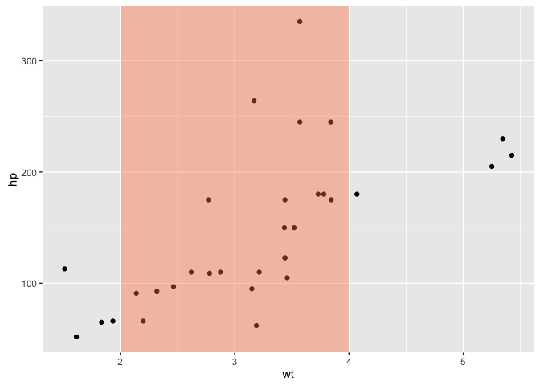
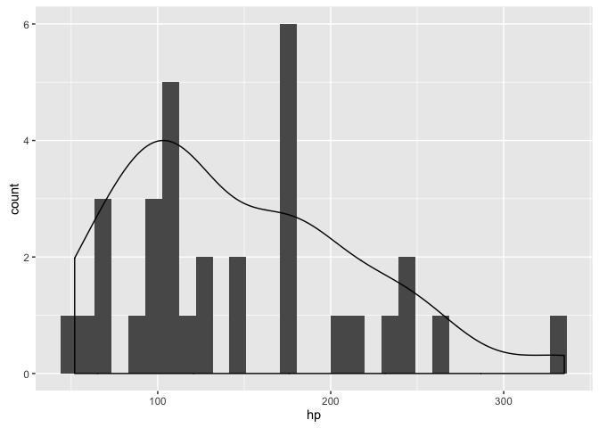
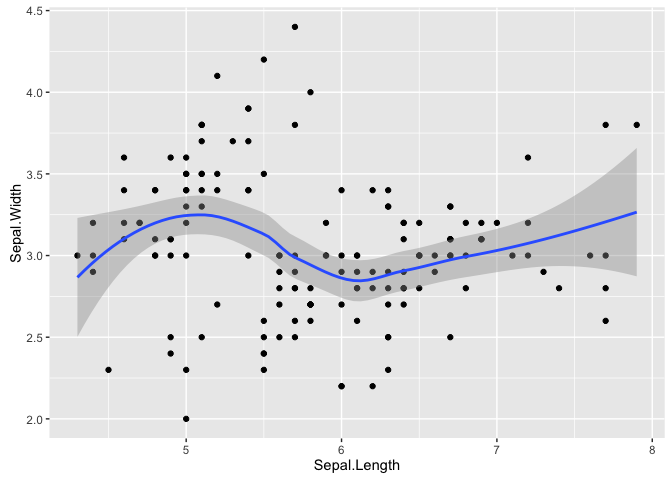
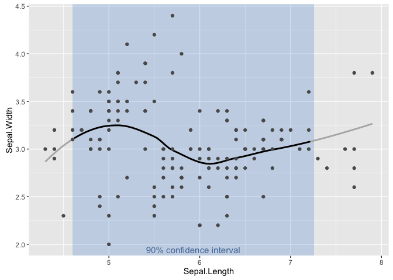
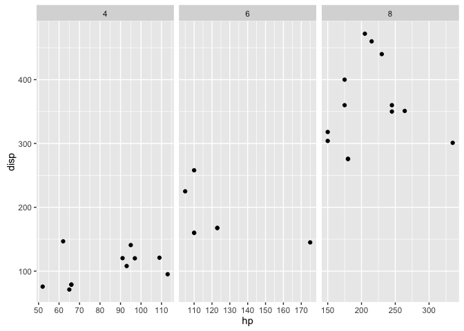
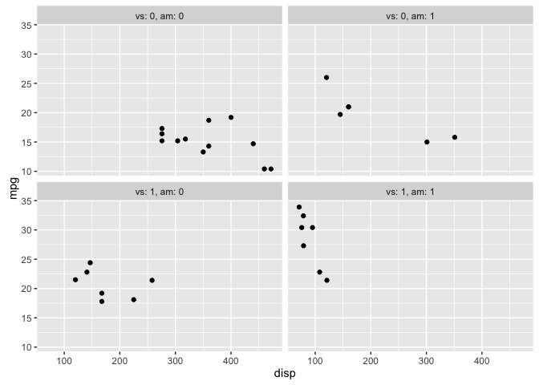

[`ggplot2`](http://ggplot2.org)
===============================

Use special symbol in labels
----------------------------

-   Text labels: `parse = T` inside `geom_text()` or `annotate()`
-   Axis labels: `expression(alpha)` to get greek alpha
-   Facet labels: Use `labeller = label_parsed()` inside `facet`
-   Legend labels: Use `bquote(alpha == .(value))`

Note:

-   `bold('bold')`, `italic('italic')`, `atop('top','bottom')`
-   `*` is a non space separator, `~` is to add spaces
-   `[]` for subscript and `^` for superscript
-   `bquote()` when substitutions are needed `.(sub)` to substitute an object
-   `help('plotmath')` for more info

Example: `labs(x = expression(bold(T[max])~(h))`

Transparent rectangles
----------------------

Add transparent rectangle to highlight graph area.

``` r
# Create data for rectangle
rect <- data.frame(xmin = 2, xmax = 4, ymin = -Inf, ymax = Inf)

# Create plot
ggplot(data = mtcars, aes(x = wt, y = hp)) +
  geom_point() +
  geom_rect(data = rect, aes(xmin = xmin, xmax = xmax, 
                             ymin = ymin, ymax = ymax),
            fill = 'coral', alpha = 0.4, inherit.aes = FALSE)
```

<!-- -->

Add mean or median to dotplot
-----------------------------

Not working with `ggplot2` v2.0.1

``` r
ggplot(data = mtcars, aes(x = cyl, y = hp, color = cyl)) + 
  geom_point() +
  geom_errorbar(stat = 'hline', yintercept = 'mean', width = 0.8, 
                aes(ymax = ..y.., ymin = ..y..))
```

Scale `geom_density()` to `geom_histogram()`.
---------------------------------------------

``` r
ggplot(mtcars, aes(x = hp)) +
  geom_histogram() +
  geom_density(aes(x = hp, 4 * ..scaled..), inherit.aes = FALSE)
```

    ## `stat_bin()` using `bins = 30`. Pick better value with `binwidth`.

<!-- -->

Correlation graphs
------------------

Uses the package [`GGally`](https://cran.r-project.org/web/packages/GGally/GGally.pdf).

``` r
library(GGally)
ggpairs(data, columns = 1:7, colour = 'sex', 
        lower = list(continuous = 'smooth'), 
        diag  = list(continuous = 'density', discrete = 'bar'),
        axisLabels = 'show')
```

[`gridExtra`](https://cran.r-project.org/web/packages/gridExtra/index.html)
---------------------------------------------------------------------------

The function `grid.arrange()` draws directly on a device while `arrangeGrob()` doesn't draw anything but returns a grob.

``` r
# Plot 4 graphs with different panel size
grid.arrange(P1, P2, P3, P4, 
             ncol = 2, nrow = 2, 
             widths = c(4, 1), heights = c(1, 4))
```

Work around smooth curves
-------------------------

### Classic smooth

``` r
ggplot(iris, aes(x = Sepal.Length, y = Sepal.Width)) +
  geom_point() +
  geom_smooth()
```

<!-- -->

### Special smooth

The special smooth visually gives less importance to edges of the smooth curve by plotting data outside 90% confidence interval in light grey.

``` r
# 90% CI of the Independent variable
CI90     <- quantile(iris$Sepal.Length, c(0.05, 0.95))

# Generate ggplot with smooth
Gsmooth  <- ggplot(data = iris, 
                   aes(x = Sepal.Length, y = Sepal.Width)) +
  stat_smooth(method = 'loess', se = FALSE)

# Get the data from the smooth
Gsmooth  <- as.data.frame(ggplot_build(Gsmooth)$data)

# Subset the 90% CI of the smooth
Gsmooth  <- Gsmooth[Gsmooth$x >= CI90[1] & Gsmooth$x <= CI90[2], ]

p <- ggplot()
  
# Rectangle showing the 90%CI
p <- p + geom_rect(aes(xmin = CI90[1], xmax = CI90[2],
                       ymax = Inf, ymin = -Inf), 
                   alpha = 0.2, fill = 'dodgerblue3')
  
# Full smooth as a grey line
p <- p + geom_smooth(data = iris, aes(x = Sepal.Length, y = Sepal.Width), 
                     method = 'loess', 
                     se = FALSE, 
                     size = 1, 
                     col = 'grey70')
  
# 90% CI smooth as black continuous line
p <- p + geom_line(data = Gsmooth, aes(x = x, y = y), size = 1, col = 'black')
  
# Add actual data
p <- p + geom_point(data = iris, aes(x = Sepal.Length, y = Sepal.Width), 
                    col = 'grey35')
  
  # Add labels
p <- p + annotate('text', x = mean(CI90), y = -Inf, 
                  label = '90% confidence interval',
                  vjust = -0.5,
                  col = 'dodgerblue4', alpha = 0.7, size = 4)
print(p)
```

<!-- -->

Scales
------

### New color schemes (+ invert color scale)

``` r
scale_fill_manual(values = rev(RColorBrewer::brewer.pal(6, 'Reds')))
```

For more information visit the [ColorBrewer](http://colorbrewer2.org) page

### Remove legend for a given aesthetic

``` r
scale_linetype_identity()
```

### Remove an axis

``` r
scale_x_continuous(NULL, breaks = NULL)
```

### Expand the limits

``` r
expand_limits()
```

### Special breaks for each panel

``` r
ebreaks <- function(...) {
  function(x) {    # x contains min and max for each panel
    if (x[1] < 120) { 
      breaks <- seq(0, 200, 10)
    } else { 
      breaks <- seq(150, 350, 50)
    }
    return(breaks) # Return all breaks
  }}

ggplot(mtcars, aes(x = hp, y = disp)) +
  geom_point() +
  scale_x_continuous(breaks = ebreaks()) +
  facet_wrap(~ cyl, scales = 'free_x')
```

<!-- -->

Annotations
-----------

### Based on graph coordinates

``` r
annotate(..., nudge_y = 3, nudge_x = 10)
```

### Based on relative positioning

``` r
annotate(..., hjust = 1 , vjust = 0)
```

### Special annotations

``` r
annotation_custom()    # Special annotation function
annotation_logticks()  # For creating nice logscale
```

Control the legend
------------------

``` r
guides(fill = guide_legend(reverse = TRUE))
```

See also `guide_colorbars()`

Access the `ggplot2 lm()` data
------------------------------

``` r
fortify.lm()
```

Use the labeller function
-------------------------

``` r
ggplot(mtcars, aes(x = disp, y = mpg)) + 
  geom_point() + 
  facet_wrap(~ vs + am, 
             label = labeller(.default = label_both, .multi_line = FALSE)) 
```

<!-- -->

Sliders with manipulate
-----------------------

``` r
library(manipulate)
manipulate(
  ggplot(data = mtcars, aes(x = hp , y = cyl)) + 
    geom_line(), 
  prm = slider(0, 20, 10, step = 1)
)
```
