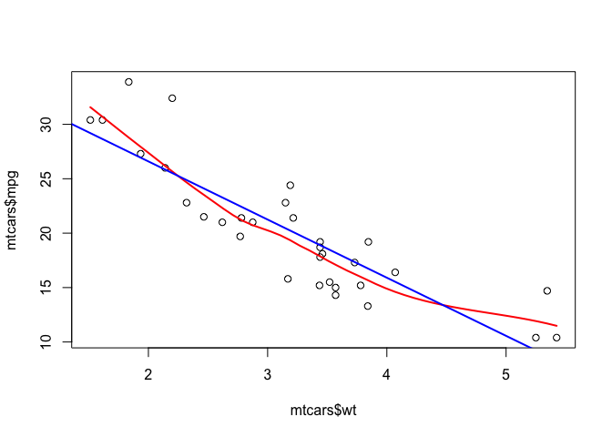
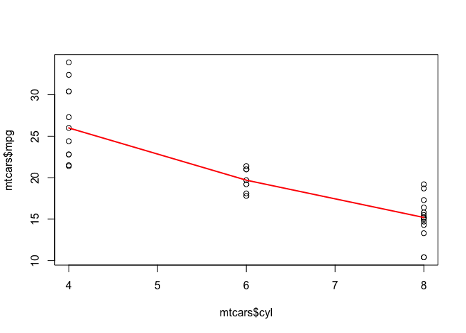
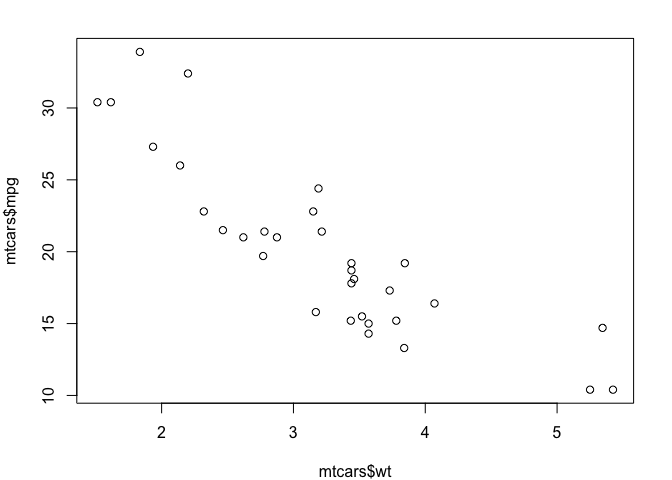

Base plots
==========

Add loess or linear regression line
-----------------------------------

``` r
plot(mtcars$wt, mtcars$mpg)

# Loess line
lines(loess.smooth(mtcars$wt, mtcars$mpg), col = 'red', lwd = 2)

# Add regression line
myLm <- lm(mpg ~ wt, data = mtcars)
abline(myLm, col = 'blue', lwd = 2)
```

<!-- -->

``` r
# Print slope and intercept
myLm$coefficients[1]
```

    ## (Intercept) 
    ##    37.28513

``` r
# Print R^2
summary(myLm)$r.squared * 100
```

    ## [1] 75.28328

Add median line with aggregate
------------------------------

``` r
plot(x = mtcars$cyl, y = mtcars$mpg)
lines(aggregate(mpg ~ cyl, data = mtcars, quantile, probs = 0.5),
      lwd = 2, col = 'red')
```

<!-- -->

Correlation graphs
------------------

``` r
pairs(iris[1:4], main = 'Title', pch = 19, 
      col = c('red', 'green3', 'blue')[unclass(iris$Species)])
```

<!-- -->

Incline axis label
------------------

``` r
# Plot without x axis
plot(mtcars$wt, mtcars$mpg, xaxt = 'n')

# Creates tick mark
xtick <- pretty(range(mtcars$wt))

# Add the tick mark on the x axis
axis(1, at = xtick, labels = FALSE)

# Add axis label
text(x = xtick[-c(1, length(xtick))], 
     labels = xtick[-c(1, length(xtick))], 
     par('usr')[3], srt = 45,
     adj = c(2, 2), xpd = TRUE)
```

<!-- -->

Reduce margins
--------------

``` r
par(mfrow = c(1, 1), 
    mar   = c(3, 3, 1, 1) + 1)
plot(mtcars$wt, mtcars$mpg)
```

<!-- -->

Remove limits expantion
-----------------------

Equivalent to `expand_limits()` in `ggplot2`.

``` r
plot(mtcars$wt, mtcars$mpg, xaxs = 'i', yaxs = 'i')
```

<!-- -->
